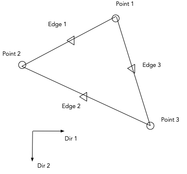

# The Reissner-Mindlin Triangular Plate



The Reissner-Mindlin formulation is a plate and shell formulation for moderate and thin plate thickness. The Arnold-Douglas implementation uses conforming linear interpolations for rotations, enriched with an interior bubble mode and non-conforming linear interpolations for the out of plane displacements. The formulation is a three field mixed interpolation on rotations, out of plane displacements and transverse shear. The formulation avoids the so called locking problem.

## Building the program, plate
The program is built with cmake. Please
review the cmake file, CMakeLists.txt, in the program root directory.
The program requires the external libraries Blas and Lapack

* From a terminal, in the program root directory create the build dir
```
mkdir build
cd build
```

* Run the cmake program builder,

```
cmake ..
```

* Build the program with make using the generated Makefile
```
make
```

If the build is succesful a new executable, plate,  will be available in the bin directory.
## Run the program

* Go to the example directory
* Run the program,
  
```
  ../build/bin/plate 3-patch.inp
```

The generated output is available in the new file 3-patch.rep

## Program commands
Command | Record |Comment |
------------|-------|-------------------------|
*diagnostic | [0-5] | none,error,info,echo,debug,detail
*thickness  | value  | Plate thickness
*young      | value  | Young's Modulus
*poisson    | [0-0.5] | Poisson's ratio
*point      | p-name 3-coord  | Point name and X Y Z coordinates
*plate      | e-name 3-p-name | Plate name and 3 point names
*pressure   | @ value  | Pressure on all elements, pressure value
*pressure   | e-name value | element name, pressure
*force      | p-name value | Force on Point name, value
*moment     | p-name dir value | Moment on Point name, dir, value
*lforce     | e-name edge-id value | Line Force on element name, edge id, value
*lmoment    | e-name edge-id dir value | Line Moment on Element name, edge id, moment dir ,value
*support    | e-name edge-id  | Fix support on element name, edge id
*lsupport   | e-name edge-id dir | Fix Rotation on element name, edge id, rotation dir
*solve | run | Run the program
*end | | End the program
$ | | A line with an $ char is ignored

## Example. 


### example/3-patch.inp 

1x3 cantiler plate with fixed rotations and displacement in one end and distributed moment in the other end. Poisson ratio  = 0

#### Analytical solutions,

```
End Rotation     = M L / EI       = 0.54
End Displacement = M L^2 / 2 EI   = 0.81

E = 10^5
I = Thickness ^ 3 / 12
Thickness = 0.1
M = 1.5
L = 3
```
### example/3-patch-poisson.inp

Same problem as above but with Poisson ratio = 0.3 . Transversal edge rotations are fixed to simulate an infinite long plate in the transversal direction.

#### Analytical solutions,

```
End Rotation     = (1 - PR*PR ) M L / EI       = 0.4914
End Displacement = (1 - PR*PR ) M L^2 / 2 EI   = 0.7371

PR = 0.3
```

## Reference
Arnold, Douglas N., and Richard S. Falk. "A uniformly accurate finite element method for the Reissner-Mindlin plate." SIAM Journal on Numerical Analysis 26.6 (1989): 1276-1290.