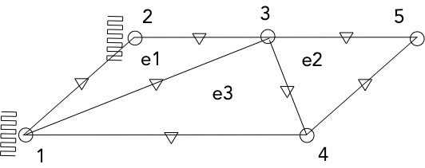

# The Reissner-Mindlin Triangular Plate

The Reissner-Mindlin formulation is used for plates and shells of moderate thickness. The Arnold-Douglas implementation uses consistent linear interpolatios for rotations, enriched with an interior bubble mode and non-conforming linear interpolations for the out of plane displacements. The formulation is a three field mixed interpolation on rotations, out of plane displacments and transverse shear. The formulation avoids the so called locking problem.

## Building the program
Review the cmake file, CMakeLists.txt, in the program root directory.
The file requires the system libraries Blas and Lapack

From a terminal, in the program root directory make a build dir

mkdir build
cd    build
cmake ../
make

Now the program plate is in the bin directory
## Run the program

Go to the example directory
Run the program,
../build/bin/plate 3-patch.inp

The answers can be found in the file 3-patch.rep

## Program commands
|Command | Record |Comment |
|------------|--------------------------------|
|*diagnostic | 0 to 5 | 0 = none, 5 detail log
|*thickness  | float  | Plate thickness
|*young      | float  | Young's Modulus
|*poisson    | 0 to 0.5 | Poisson's ratio
|*point      | 3-float  | Point X Y Z coordinates
|*plate      | 3-string | Plate 3 point names
|*pressure   | @ pressure  | Pressure on all elements, value
|            | e-name pressure | element name, pressure
|*force      | p-name value | Force on Point name, value
|*moment     | p-name value | Moment on Point name, value
|*lforce     | e-name s-id value | Line Force on element name, side id, value
|*lmoment    | e-name s-id dir value | Line Moment on Element name, side id, moment dir ,value
|*support    | e-name s-id  | Fix support on element name, side id
|*lsupport   | e-name s-id dir | Fix Rotation on element name, side id, dir
|*solve | run | Run the program
|*end | | End the program
|$ | | A line with the $ sign is ignored

## Example. 

### example/3-patch.inp 1x3 cantiler plate with fixed rotations and displacement in one end and distributed moment in the other end. Poisson ratio  = 0

Analytical solutions,

Rotation     = M L / EI       = 0.54
Displacement = M L^2 / 2 EI   = 0.81

E = 10^5
I = Thickness ^ 3 / 12
Thickness = 0.1
M = 1.5
L = 3
### example/3-patch-poisson.inp. Same problem as above but with Poisson ratio = 0.3 . Transversal side rotations are fixed to simulate an infinite long plate.

Analytical solutions,

Rotation     = (1 - PR*PR ) M L / EI       = 0.4914
Displacement = (1 - PR*PR ) M L^2 / 2 EI   = 0.7371

PR = 0.3

## Reference
Arnold, Douglas N., and Richard S. Falk. "A uniformly accurate finite element method for the Reissner-Mindlin plate." SIAM Journal on Numerical Analysis 26.6 (1989): 1276-1290.